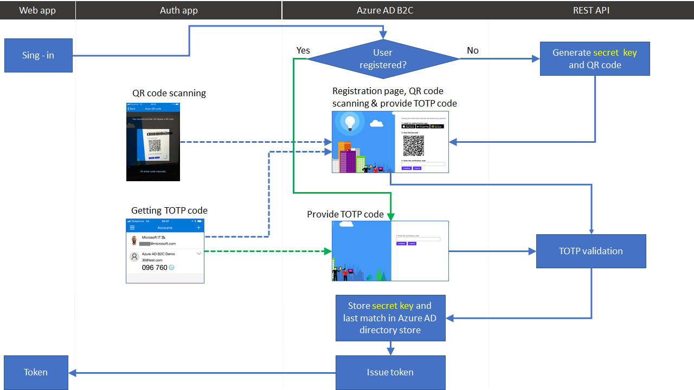
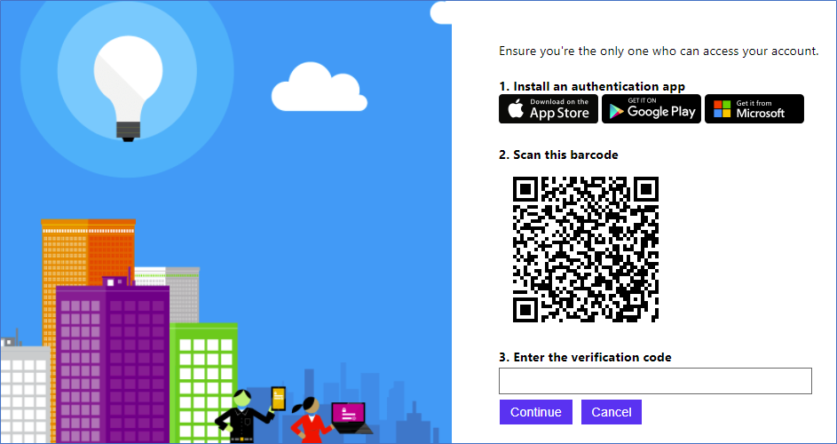
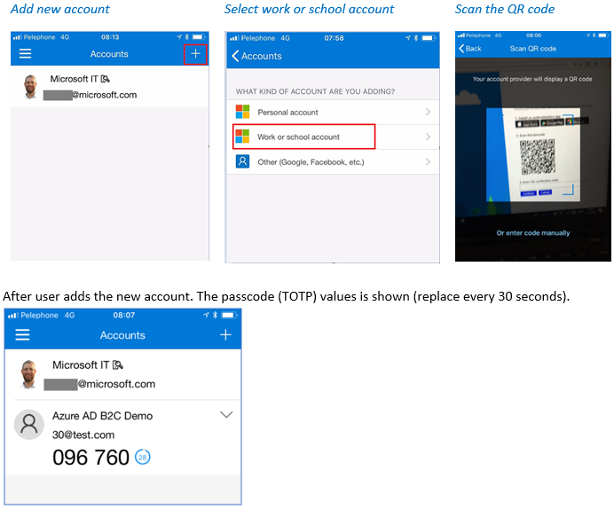

# Azure AD B2C: TOTP multi-factor authentication

With Azure Active Directory (Azure AD) B2C, you can integrate TOTP-based Multi-Factor Authentication so that you can add a second layer of security to sign-up and sign-in experiences in your consumer-facing applications. This requires using custom policy and custom REST API endpoint. If you already created sign-up and sign-in policies, you can still enable Multi-Factor Authentication.

Following component are involved in the Azure AD B2C TOTP multi-factor authentication solution code sample:
1.	**Azure AD B2C** - The authorization server, responsible for verifying the user's identity, granting (and revoking) access to resources, and issuing tokens. It is also known as the identity provider. 
1.	**Web or mobile application** – also known as relying party application. An application that relies on identity provider (Azure AD B2C) for authentication. 
1.	**Custom Rest API** - With the Identity Experience Framework, which underlies AD B2C, you can integrate with a RESTful API in a user journey. Adding your own business logic. The Identity Experience Framework sends data to the RESTful service in an Input claims collection and receives data back from RESTful in an Output claims collection. The call to the REST API secure by client certificate. We use custom REST API to prepare a QR code, register user’s security code, and verify the TOTP code.
1.	**TOTP** - Time-based One-time Password algorithm that computes a one-time password from a shared secret key (the REST API and the authenticator app) and the current time.
1.	**QR Code** - A machine-readable optical label that contains information about the item to which it is attached. In this case, the QR code contains the TOTP URI
1.	**Authenticator app** – Microsoft (or Google) Authenticator app provides an additional level of security by using TOTP (and other methods).

## Perquisites
- All the components motioned above up, running, and well configured

- Azure AD B2C [b2clogin.com sign-in URL](https://docs.microsoft.com/en-us/azure/active-directory-b2c/b2clogin) and JavaScript client side enabled (in public preview). To enable JavaScript client-side code in your Azure AD B2C policy:
    - [Add the ScriptExecution element to the relying party policy](https://docs.microsoft.com/en-us/azure/active-directory-b2c/javascript-samples).
    - Set the [page contract](https://docs.microsoft.com/en-us/azure/active-directory-b2c/page-contract) for **all** content definitions in the base/extension policy with the new DataUri value. 
 
- The .Net core solution use following NuGet packages: OtpNet
and	QRCoder 

- The solution is based on an extension attribute. Read here how to [configure extension attributes](https://docs.microsoft.com/en-us/azure/active-directory-b2c/active-directory-b2c-create-custom-attributes-profile-edit-custom). 

## Deploy to Azure
To automatically deploy the backend REST API to Azure App Services, click this button

[](https://azuredeploy.net/)

## 1. Sign-in flow
Following diagram describes the sign-in flow with MFA registration and verification. The solution is based on TOTP. A TOTP is time-based one-time password that provides temporary passcode, generated by an algorithm running in the REST API service. The algorithm generates a password (temporary passcode) uses combination of a secret key (generated by the REST API and is stored in Azure AD B2C directory store) with the current timestamp (ensuring that each password is unique).  During registration and sign-in user provides the passcode to Azure AD B2C to complete the sign-in process. The secret key is shared between user’s authenticator app and the REST API (stored in Azure AD B2C directory store), allowing the REST API to validate the passcode.

 

## 2. Mobile device enrollment flow
On the first-time user sign-in or when MFA is required for the first time (for example accessing highly confidential data), Azure AD B2C custom policy (Henceforth B2C) checks if the user already registered (extension_StrongAuthenticationAppSecretKey claim exists in Azure Active Directory identity store’s user account). If not exist, B2C calls the REST API GenerateTOTP endpoint to generate secret key and QR code for the user. The REST API:
1.	Reads the user sign-in name
2.	Generates a random secret key
3.	Creates a TOTP URI (see the URI format later)
4.	Generates a QR code for the TOTP URI
5.	Returns the QR code bitmap, in based64 formant and the generated secret key, in base64 format

### 2.1 TOTP URI generation
The URI includes following data, and may contains more, such as TOTP time (default 30 seconds) and size (default 6 digits):
- **Protocol** - otpauth://totp
- **User name**: B2CDemo:someone@contoso.com
- **Secret key**:  F4KRXSGXYBYT7BQ5THURPPH2RQ27JGSJ
- **Issuer**: Azure AD B2C Demo

Following is an example of such URI: 
```
otpauth://totp/B2CDemo%3asomeone%40contos.com?secret=F4KRXSGXYBYT7BQ5THURPPH2RQ27JGSJ&issuer=Azure%20AD%20B2C%20Demo
```

### 2.2 QR code scanning and validation
After the REST API returns the registration information back to Azure AD B2C. The user moves to the next orchestration step specified in the user journey. This orchestration step reads the QR code (in base64 format) and uses JavaScript to present the QR code as an image user can scan.



### 2.3 Adding new identity account to Microsoft authenticator
At this point, the user needs to download and install the authenticator app (Microsoft, Google, or any other authenticator app such as Authy app). In Microsoft Authenticator, click add account, select the account type, and scan the QR code provided by Azure AD B2C.



Back to Azure AD B2C, user needs to copy and type the passcode (wining the 30-seconds timeframe) in Azure AD B2C and click continue.

### 2.4 TOTP code verification by Azure AD B2C
When user clicks on **continue**, Azure AD B2C invokes the REST API VerifyTOTP endpoint. Sending the code provided by the end user, the user’s secret and the last time of the match (this data comes from the user’s Azure AD account). We use the last time of the match to prevent and verify the verification code has already been used. The REST API validates the code provided by the end user with the secret key and last match time.
If the code isn’t valid, a user-friendly error is shown to end user, asking to provide the TOTP verification code again. Note: Since the TOTP code is valid on for 30 seconds, a user may provide the new value. Azure AD B2C will call the validation endpoint again, until the user provides valid value.
On the next step, Azure AD B2C stores the user’s secret key and last time match in Azure Active Directory identity 

## 3. Sign-in and MFA validation
1. Azure AD checks if the user already registered (extension_StrongAuthenticationAppSecretKey claim exists). If exists, Azure AD B2C asks the user to enter the verification code
1. End user needs to open the authentication app and copy the TOTP verification code and click continue.
1. When user clicks on continue, Azure AD B2C runs the flow describe in section 2.4 TOTP code verification by Azure AD B2C

## Community Help and Support
Use [Stack Overflow](https://stackoverflow.com/questions/tagged/azure-ad-b2c) to get support from the community. Ask your questions on Stack Overflow first and browse existing issues to see if someone has asked your question before. Make sure that your questions or comments are tagged with [azure-ad-b2c].
If you find a bug in the sample, please raise the issue on [GitHub Issues](https://github.com/azure-ad-b2c/samples/issues).
To provide product feedback, visit the Azure Active Directory B2C [Feedback page](https://feedback.azure.com/forums/169401-azure-active-directory?category_id=160596).

> Note:  This sample policy is based on [SocialAndLocalAccounts starter pack](https://github.com/Azure-Samples/active-directory-b2c-custom-policy-starterpack/tree/master/SocialAndLocalAccounts). All changes are marked with **Demo:** comment inside the policy XML files. Make the necessary changes in the **Demo action required** sections.
